# Track Changes & Comments — Test Report

**Date:** 2026-03-28
**Tester:** Claude (automated via Chrome DevTools MCP)
**App version:** 1.0.6 (dev mode, Vite renderer on localhost:5173)

---

## Summary

All track-changes and comment features passed. No bugs found during this test run.

| Feature | Result |
|---|---|
| Enable / disable Track Changes toggle | ✅ Pass |
| Tracked insertion | ✅ Pass |
| Tracked deletion | ✅ Pass |
| Accept individual change | ✅ Pass |
| Reject individual change | ✅ Pass |
| Accept All | ✅ Pass |
| Reject All | ✅ Pass |
| Add comment (inline highlight) | ✅ Pass |
| Reply to comment | ✅ Pass |
| Resolve comment | ✅ Pass |
| Delete comment | ✅ Pass |

---

## Test Setup

A blank document was opened and the following sentence typed as baseline content (Track Changes **off**):

> The quick brown fox jumps over the lazy dog. This is a sample document for testing track changes and comments in Markover.

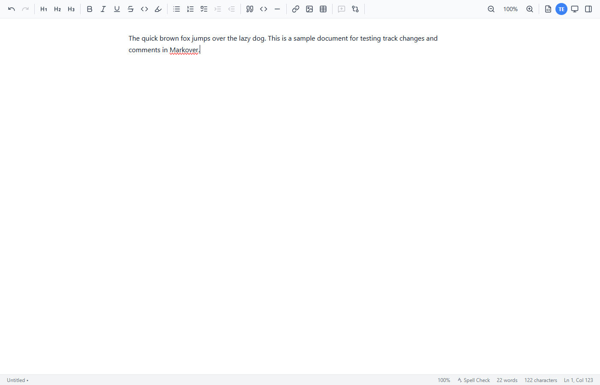

---

## Track Changes Tests

### 1. Enable Track Changes

Clicked the **Track Changes: OFF** toolbar button. The button toggled to **Track Changes: ON** and the sidebar automatically opened to the Changes panel, showing _"No changes tracked yet."_

---

### 2. Tracked Insertion

Cursor was placed before "jumps" and the word **"swiftly "** was typed. The inserted text appeared in the editor with a green insertion mark. The Changes panel showed:

- Author: testuser
- Type: **Added**
- Date: 2026-03-28
- Content: `swiftly`
- Buttons: **Accept** / **Reject**

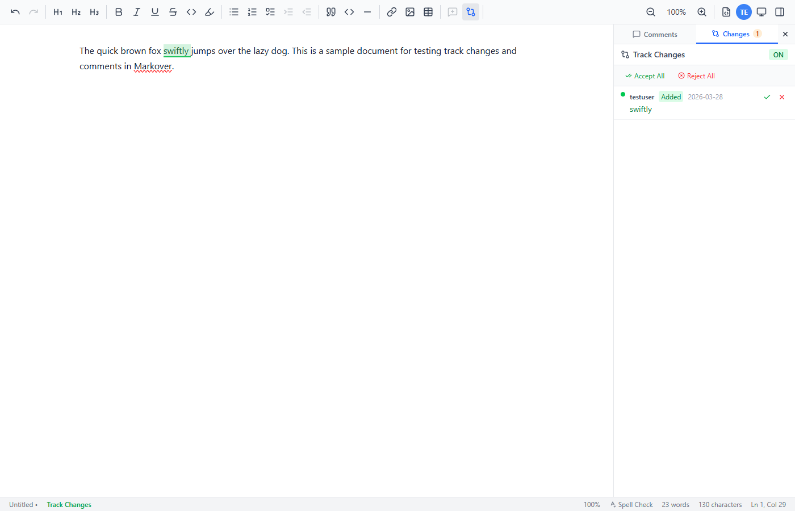

---

### 3. Tracked Deletion

The word **"lazy"** was selected and deleted. The text remained visible in the editor with a red strikethrough (deletion mark). The Changes panel updated to show 2 changes:

- Change 1 — Added: `swiftly`
- Change 2 — Deleted: `lazy`

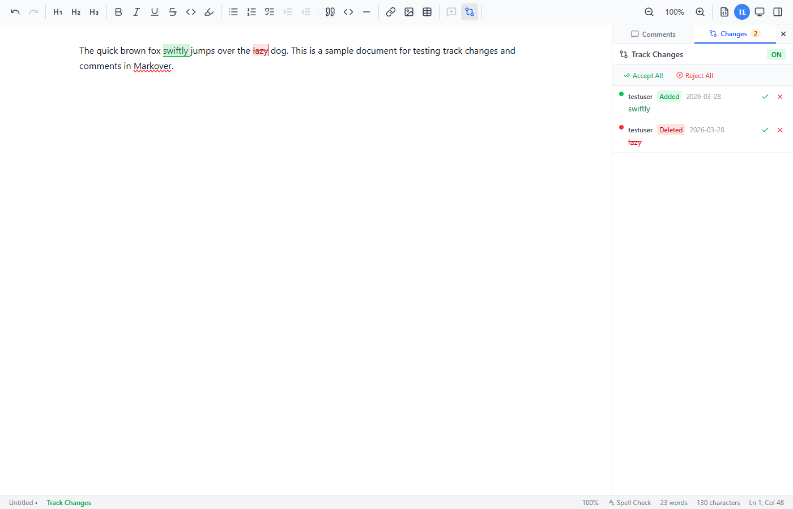

---

### 4. Accept Individual Change

Clicked **Accept** on the "swiftly" insertion. Result:

- "swiftly" became permanent plain text (green mark removed)
- Panel change count dropped from **2 → 1**
- Only the "lazy" deletion remained

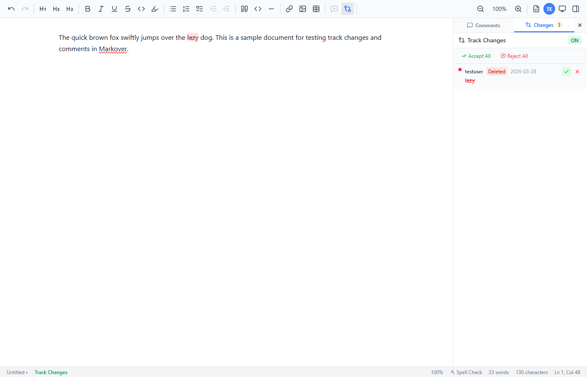

---

### 5. Reject Individual Change

Clicked **Reject** on the "lazy" deletion. Result:

- "lazy" was **restored** in the editor (strikethrough removed)
- Panel count dropped from **1 → 0**
- Panel showed _"No changes tracked yet."_

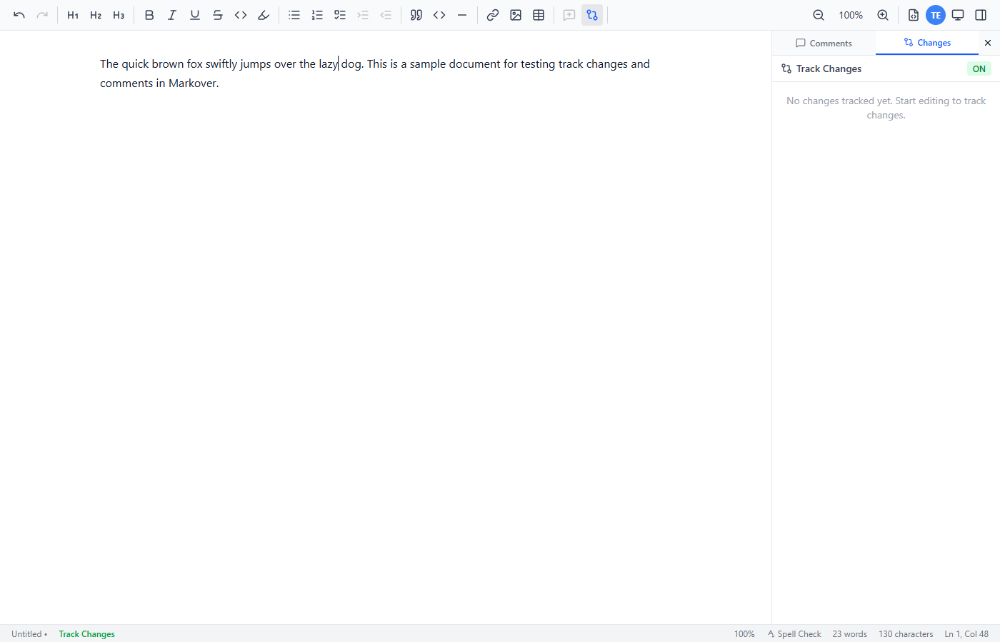

---

### 6. Accept All

Two new tracked changes were made:

- **Inserted** "clever " before "dog"
- **Deleted** "sample"

Clicked **Accept All**. Result:

- Both changes committed simultaneously
- "clever" became permanent; "sample" was permanently removed
- Panel cleared to _"No changes tracked yet."_

Before:

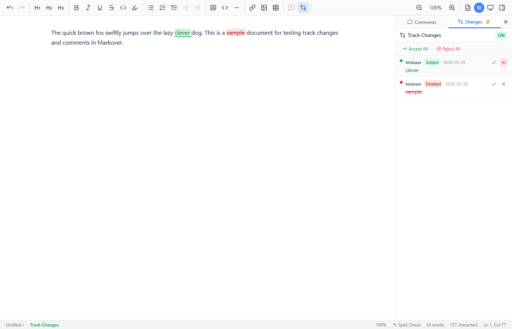

After:

> **Note:** Accepting the deletion of "sample" leaves a double-space ("a  document") since the surrounding spaces are not trimmed. This is expected CommonMark-compatible behaviour — the serializer preserves the exact surrounding content.

---

### 7. Reject All

Two further tracked changes were made:

- **Inserted** "red " before "fox"
- **Deleted** "clever"

Clicked **Reject All**. Result:

- Both changes rolled back simultaneously
- "red" was removed; "clever" was restored
- Panel cleared to _"No changes tracked yet."_

Before:

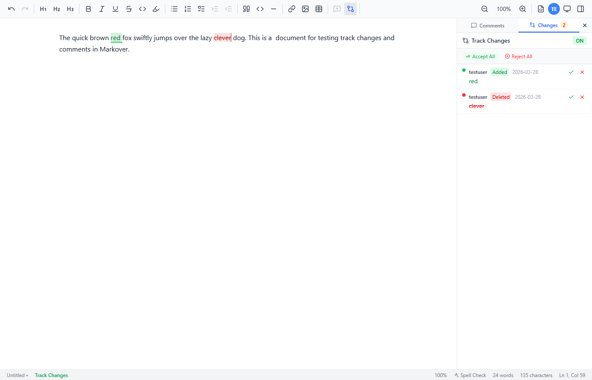

After:

---

## Comments Tests

Track Changes was turned **off** before comment testing.

### 8. Add Comment

The word **"swiftly"** was selected in the editor. The **Add Comment** toolbar button became enabled (it is disabled with no selection). Clicking it opened the inline comment dialog.

Comment typed:

> Consider changing "swiftly" to "gracefully" for better tone.

The **Add Comment** submit button was disabled until text was entered, then enabled.

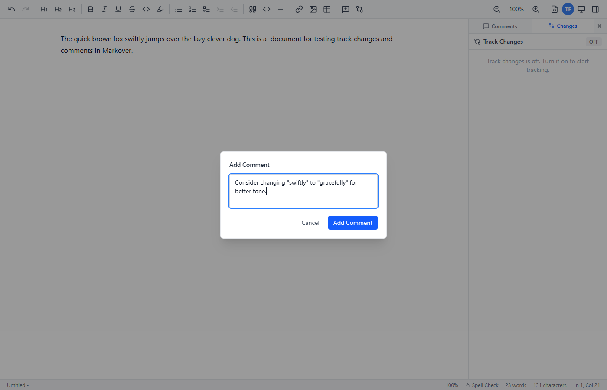

---

### 9. Comment Created

After clicking **Add Comment**:

- "swiftly" gained a **yellow highlight** in the editor
- The sidebar switched to the Comments panel showing **Comments (1)**
- Comment card displayed: author `testuser`, status `open`, timestamp `just now`, full comment text
- Controls: **Reply** input, **Resolve**, **Delete** buttons
- A filter dropdown (All / Open / Resolved / Pending) was available

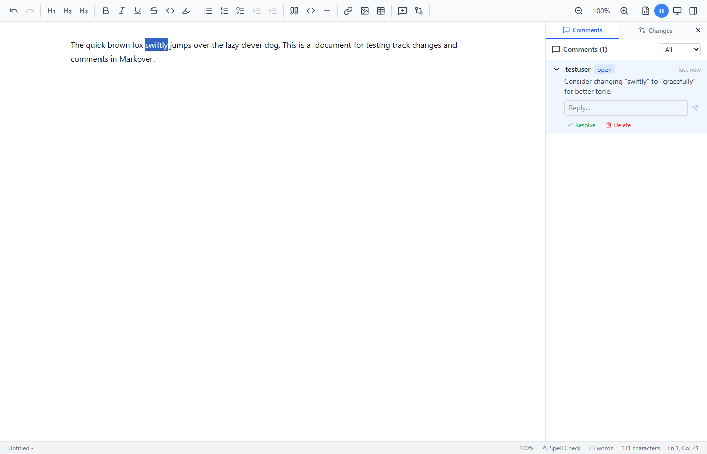

---

### 10. Reply to Comment

Clicked the **Reply** text field, typed:

> Agreed, "gracefully" fits the sentence better.

Pressed **Enter**. The reply appeared as a sub-entry under the original comment, attributed to `testuser` with its own timestamp.

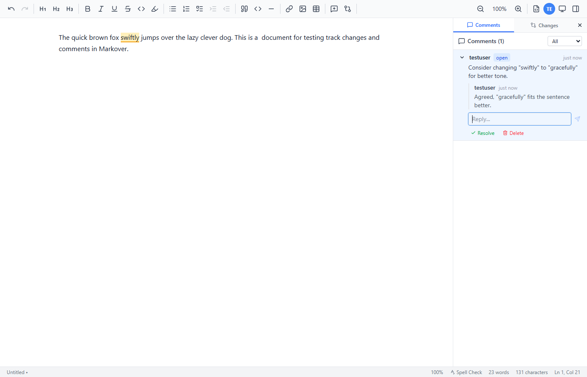

---

### 11. Resolve Comment

Clicked **Resolve**. Result:

- Comment status changed from `open` → `resolved`
- The **Resolve** button changed to **Reopen**
- The highlight on "swiftly" remained (highlight is tied to the comment thread existing, not its status)

---

### 12. Delete Comment

Clicked **Delete**. Result:

- Comment thread (including reply) was removed from the panel
- Count dropped to **Comments (0)**
- Panel showed _"No comments yet."_
- The **yellow highlight on "swiftly" was removed** from the editor

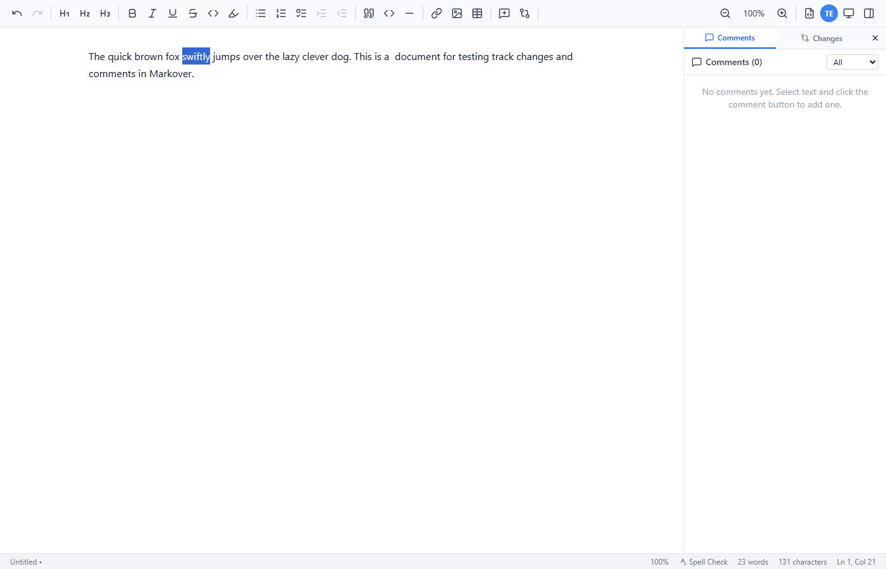

---

## Findings

### Bugs Found

None.

### Observations

1. **Double-space after word deletion (Accept All / Accept):** When a word like "sample" is deleted via track changes and accepted, the surrounding spaces produce `"a  document"`. This is cosmetically undesirable but is not a bug in the tracking system — the serializer faithfully preserves what is in the document. A future enhancement could strip adjacent duplicate spaces when accepting word deletions.

2. **Highlight persists after Resolve:** The editor highlight on commented text stays visible even after the comment is resolved (only removed on Delete). This is consistent with how Word and Google Docs behave — resolved comments are still browsable — so this is intentional behaviour, not a bug.

3. **Sidebar auto-opens on Track Changes enable:** When Track Changes is toggled on, the sidebar automatically opens to the Changes tab. This is good UX.

4. **Add Comment button is correctly disabled** when there is no text selection, and correctly enables as soon as a selection exists.
