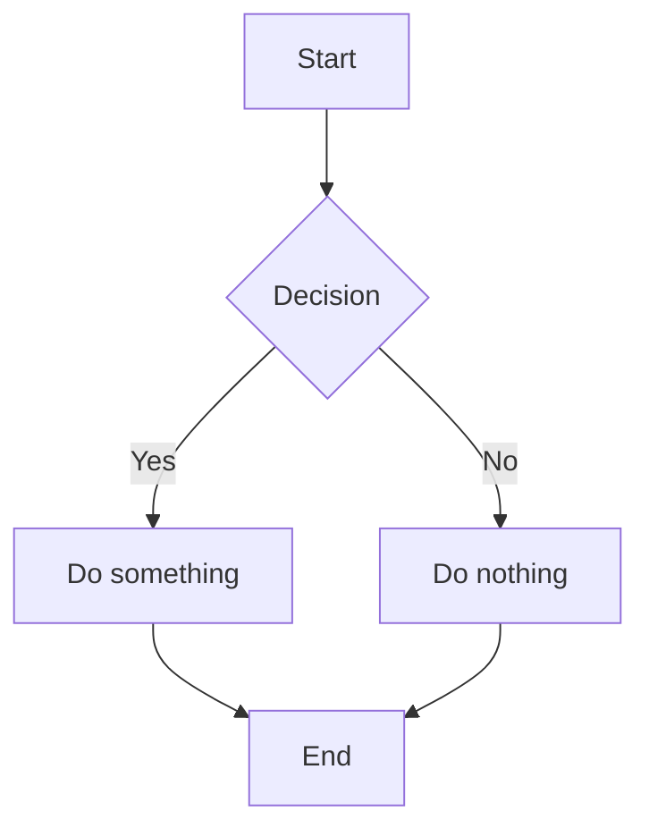

# Markover Test Document

This is a **bold** and *italic* test with some `inline code` and ~~strikethrough~~.

## Lists

- Bullet item 1
- Bullet item 2
  - Nested item
- Bullet item 3

1. First ordered
2. Second ordered
3. Third ordered

## Task List

- [x] Completed task
- [ ] Incomplete task
- [ ] Another task

## Code Block

```javascript
function hello() {
  console.log("Hello, Markover!");
}
```

## Blockquote

> This is a blockquote.
> It can span multiple lines.

## Table

| Feature | Status | Notes |
| --- | --- | --- |
| Bold | Done | Works well |
| Tables | Done | Basic support |
| Images | Partial | URL only |

## Math

Inline math: $E = mc^2$ and $\sum_{i=1}^{n} x_i$.

Block math:

$$
\int_0^\infty e^{-x^2} dx = \frac{\sqrt{\pi}}{2}
$$

## Mermaid Diagram



## Footnotes

This has a footnote[^1] and another one[^2].

[^1]: This is the first footnote.
[^2]: This is the second footnote.

## Links and Images

Here is a [link to GitHub](https://github.com) and an image:


---

That's all for now!
